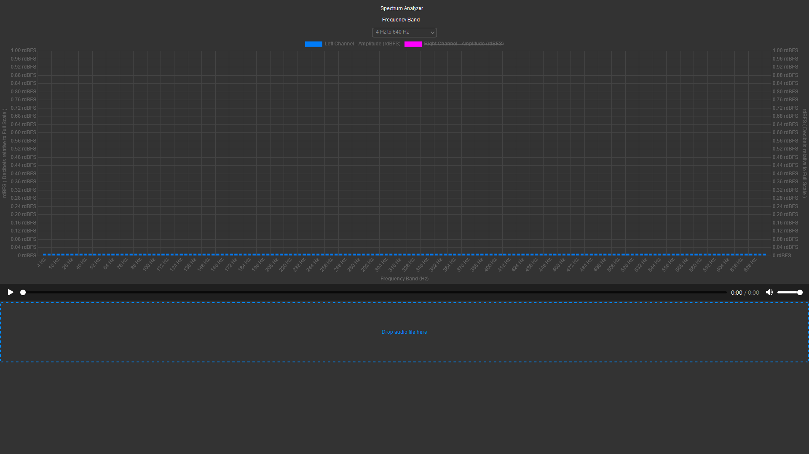

# Artificial Speech Formant Editor - Spectrum Analyzer (Beta)

## Purpose

The Artificial Speech Formant Editor is designed to facilitate the creation, manipulation, and visualization of speech formants. Speech formants are the resonant frequencies of the human vocal tract, and they are critical to the identification and articulation of vowel sounds in speech processing. This project aims to provide a user-friendly web interface where users can interactively adjust formant frequencies and amplitudes to synthesize and study artificial speech sounds.

The editor includes an interactive viewer with color-coded combo/select dropdown boxes positioned on all four extents of the graph. This allows for precise control over the speech formant parameters and real-time visual feedback on how these parameters affect the speech synthesis...

A spectrum analyzer can be a crucial tool in analyzing and improving artificial speech formants for use in text-to-speech (TTS) libraries. Formants are the resonant frequencies of the vocal tract, and they play a significant role in characterizing vowels and certain consonants, thereby influencing the intelligibility and naturalness of synthesized speech. Here's how a spectrum analyzer aids in this process:

1. **Formant Analysis and Identification**: A spectrum analyzer helps in identifying the formant frequencies by displaying the frequency spectrum of the audio signal. This is essential for understanding the acoustic characteristics of speech sounds. By analyzing these characteristics, developers can fine-tune the formant settings in TTS systems to more closely mimic natural speech.

2. **Quality Improvement**: By visualizing the spectral properties of artificial speech, engineers can compare it against natural speech spectra. This comparison can highlight discrepancies or areas of improvement, allowing for adjustments to the synthesis algorithms that generate the formants, leading to a more natural-sounding speech output.

3. **Tuning and Optimization**: Different languages and dialects have unique formant structures. A spectrum analyzer can assist in tuning TTS libraries for specific linguistic characteristics by ensuring that the artificial formants align with the typical formant patterns of the target language or dialect.

4. **Voice Characterization**: For creating varied and nuanced voices in TTS systems, a spectrum analyzer can help in analyzing and replicating the formant structures of different voices. This is particularly useful for creating TTS voices with specific characteristics, such as age, gender, or emotional state.

5. **Feedback for Synthesis Methods**: Whether a TTS system uses concatenative synthesis, parametric synthesis, or deep learning approaches, a spectrum analyzer provides valuable feedback on the output of these methods. Developers can see how well their synthesis method reproduces the formant patterns and make necessary adjustments.

6. **Troubleshooting Artifacts**: Sometimes, TTS systems might introduce unwanted artifacts or distortions in the speech signal. A spectrum analyzer can help identify these issues by showing unexpected spikes or troughs in the frequency spectrum, guiding the troubleshooting process.

7. **Benchmarking and Consistency**: For maintaining quality across different versions of a TTS library, a spectrum analyzer provides a quantitative way to benchmark speech quality and ensure consistency. This is crucial for iterative development and testing processes.

In conclusion, a spectrum analyzer is an indispensable tool for analyzing, developing, and refining artificial speech formants. It offers a detailed view of the spectral characteristics of speech, enabling developers to create more accurate, natural-sounding, and versatile text-to-speech libraries.

## Project Structure

The project consists of the following files, each serving a distinct purpose within the application:

### `SpectrumAnalyzer.html`

- **Purpose**: Serves as the entry point of the application. Contains the markup for the interactive viewer and dropdown elements.
- **Contents**: HTML elements for the graph container, formant control dropdowns, and references to external CSS and JavaScript files.

### `__.css`

- **Purpose**: Provides styling for the application, ensuring that the interface is visually aligned with the specifications.
- **Contents**: CSS rules for positioning the dropdown boxes, styling the graph container, and color-coding the control elements.

### `__.js`

- **Purpose**: Contains the interactive logic of the application. Handles user interactions and updates the graph in real time.
- **Contents**: JavaScript code for initializing the graph using a charting library, attaching event listeners to dropdowns, and updating formant data dynamically.

### `chart.js`

- **Purpose**: An external charting library file, such as Chart.js or D3.js, which is used to render the interactive graph.
- **Contents**: The library's source code that provides the functionality for drawing and animating the formant graph.

### `README.md`

- **Purpose**: Offers a detailed explanation of the project, how to set it up, and how to use the editor.
- **Contents**: Markdown text with setup instructions, usage guidelines, and information about the technology stack used in the project.

### `LICENSE` (Inherited)

- **Purpose**: Describes the legal conditions under which the software is released.
- **Contents**: The full text of the software license (e.g., MIT, GPL, Apache).

## How to Use

To use the Artificial Speech Formant Editor:

1. Open `SpectrumAnalyzer.html` in a web browser.
2. Use the dropdown boxes to select the desired formant frequencies and amplitudes.
3. Observe the changes in the graph as you adjust the formants.
4. Utilize the visual feedback to understand the relationship between formants and speech sounds.

## Compatibility
- **Desktop**: Firefox 121.0+ (64-bit), Chrome 93.0.4577.82+(64-bit), Edge 93.0.961.52+(64-bit)

## Contribution

Contributors are welcome to enhance the features of the Artificial Speech Formant Editor. Please read `CONTRIBUTING.md` for guidelines on how to propose changes.

## License

This project is licensed under the governing license specified in the `LICENSE` file.
